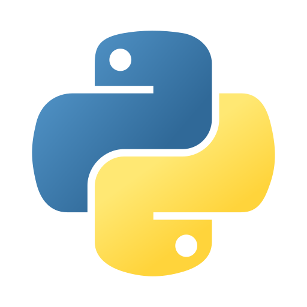
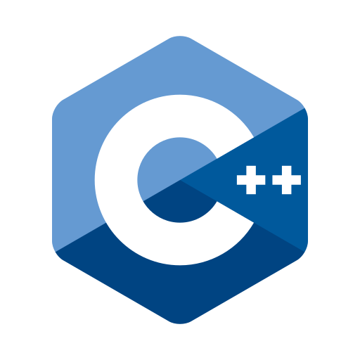
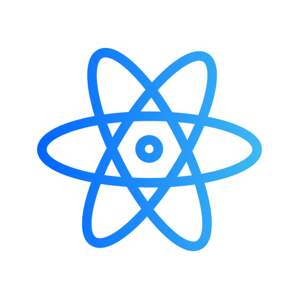
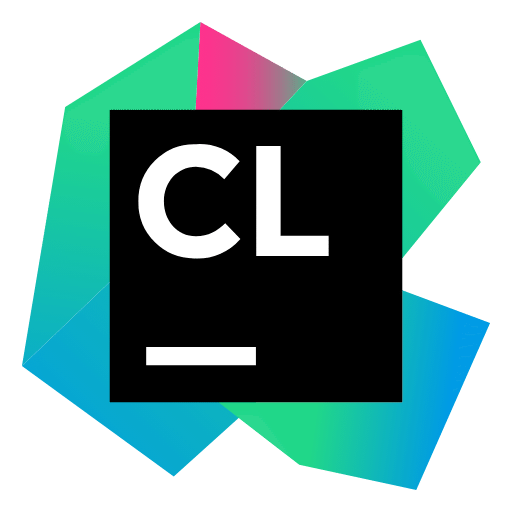

  

---

  
  &nbsp;&nbsp;
  
  &nbsp;&nbsp;
  

---

### 👨‍💻 About Me

- 🌱 Currently deepening **React.js** and sharpening **DSA in Java**
- 🤖 Building real ML systems — RAG pipelines, LLM integrations
- 🔧 Love crafting backend systems: distributed rate limiters, API gateways, containerised stacks
- 💡 Passionate about writing code that is clean, scalable, and actually ships
- 📍 Bhubaneswar, Odisha, India
- 📫 **mihirrajwow@gmail.com**

---

### 🚀 Projects

<table width="100%">
<tr>
<td width="33%" valign="top" align="center">
 

**🔐 api-gateway**

Production API Gateway with sliding-window distributed rate limiting via atomic Redis Lua scripts. JWT auth with per-user, per-endpoint enforcement.

 

 

</td>
<td width="33%" valign="top" align="center">
 

**🌿 ecosage**

RAG-powered sustainability chatbot using Haystack pipelines, local SentenceTransformers embeddings, and Claude API for generation.

 

 

</td>
<td width="33%" valign="top" align="center">
 

**📓 wownotes**

Secure MERN notes app for KIIT students — Google OAuth domain-locked, real-time single-device enforcement via Socket.IO, and an anti-DevTools security layer.

 

 

&nbsp;

</td>
</tr>
</table>

---

### 🛠️ Tech Stack

#### 💻 Languages

<table border="0" cellspacing="0" cellpadding="8">
  <tr>
    <td align="center" width="90">
       
      <b>Python</b>
    </td>
    <td align="center" width="90">
       
      <b>JavaScript</b>
    </td>
    <td align="center" width="90">
       
      <b>Java</b>
    </td>
    <td align="center" width="90">
       
      <b>C</b>
    </td>
    <td align="center" width="90">
       
      <b>C++</b>
    </td>
    <td align="center" width="90">
       
      <b>HTML5</b>
    </td>
    <td align="center" width="90">
       
      <b>CSS3</b>
    </td>
    <td align="center" width="90">
       
      <b>Dart</b>
    </td>
  </tr>
</table>

#### 📦 Libraries & Frameworks

<table border="0" cellspacing="0" cellpadding="8">
  <tr>
    <td align="center" width="90">
       
      <b>React</b>
    </td>
    <td align="center" width="90">
       
      <b>Spring Boot</b>
    </td>
    <td align="center" width="90">
       
      <b>Flutter</b>
    </td>
    <td align="center" width="90">
       
      <b>TensorFlow</b>
    </td>
    <td align="center" width="90">
       
      <b>PyTorch</b>
    </td>
    <td align="center" width="90">
       
      <b>Keras</b>
    </td>
    <td align="center" width="90">
       
      <b>Scikit-learn</b>
    </td>
    <td align="center" width="90">
       
      <b>NumPy</b>
    </td>
    <td align="center" width="90">
       
      <b>Pandas</b>
    </td>
    <td align="center" width="90">
       
      <b>Matplotlib</b>
    </td>
  </tr>
</table>

#### 🔧 Tools & Platforms

<table border="0" cellspacing="0" cellpadding="8">
  <tr>
    <td align="center" width="90">
       
      <b>Git</b>
    </td>
    <td align="center" width="90">
       
      <b>GitHub</b>
    </td>
    <td align="center" width="90">
       
      <b>VS Code</b>
    </td>
    <td align="center" width="90">
       
      <b>Linux</b>
    </td>
    <td align="center" width="90">
       
      <b>Colab</b>
    </td>
    <td align="center" width="90">
       
      <b>Jupyter</b>
    </td>
    <td align="center" width="90">
       
      <b>Android Studio</b>
    </td>
    <td align="center" width="90">
       
      <b>IntelliJ IDEA</b>
    </td>
    <td align="center" width="90">
       
      <b>PyCharm</b>
    </td>
    <td align="center" width="90">
       
      <b>CLion</b>
    </td>
    <td align="center" width="90">
       
      <b>Copilot</b>
    </td>
  </tr>
</table>

#### 🗄️ Databases

<table border="0" cellspacing="0" cellpadding="8">
  <tr>
    <td align="center" width="90">
       
      <b>MySQL</b>
    </td>
    <td align="center" width="90">
       
      <b>PostgreSQL</b>
    </td>
    <td align="center" width="90">
       
      <b>MongoDB</b>
    </td>
    <td align="center" width="90">
       
      <b>Redis</b>
    </td>
  </tr>
</table>

---

### 📊 GitHub Stats

  
  &nbsp;
  

  

---

  

